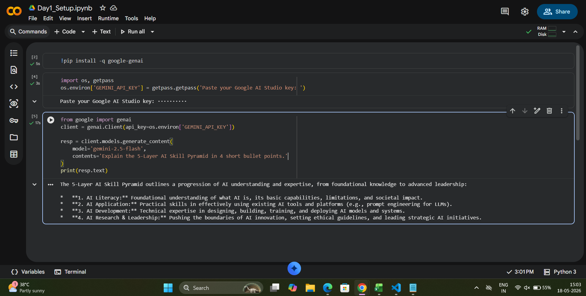

# AI Mentor Bootcamp — Naveen kumar
Public portfolio of 12-day AI Trainer Workshop. By Day 12: 6 daily notebooks + capstone Streamlit URL.

 
Commit (button at the bottom of the in-browser editor).
 
*Trainer note:* Write each mentor's repo URL on the whiteboard next to their name. By Day 12 you reference these URLs for grading.
 
*Acceptance:* https://github.com/naveenkumarprathi166/ai-mentor-portfolio is publicly accessible.

## Day 1 – Setup complete
 
- ✅ Google AI Studio API key provisioned

- ✅ Groq API key provisioned

- ✅ Hello-Gemini call working – see [Day1_Setup.ipynb](Day1_Setup.ipynb)
 
### Screenshot
 

